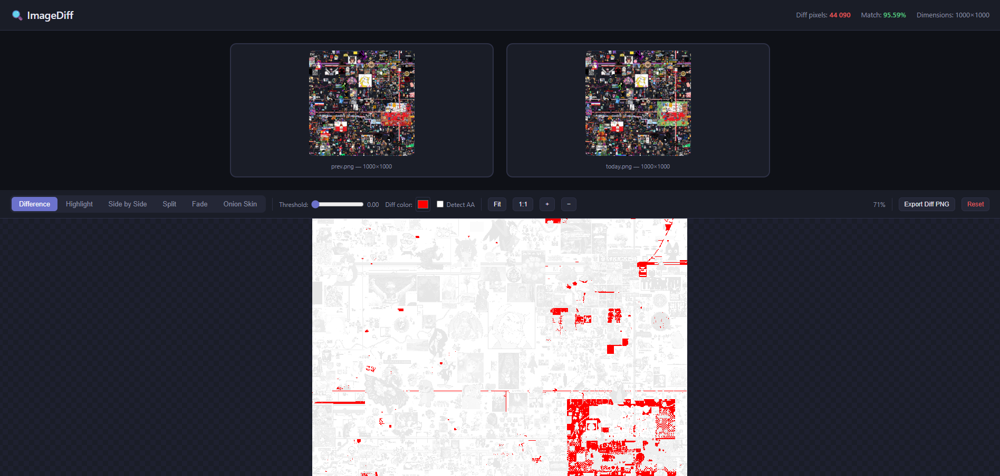

<div align="center">

# ImageDiff

[](https://www.php.net/)
[](https://symfony.com/)
[](https://www.docker.com/)
[](https://nginx.org/)
[](LICENSE)

Pixel-level image comparison tool built with Symfony and [pixelmatch](https://github.com/mapbox/pixelmatch).
All processing runs client-side in the browser. No images are uploaded to a server.



</div>

---

## Comparison Modes

| Mode | Description |
|------|-------------|
| **Difference** | Pixel diff output from pixelmatch. Changed pixels shown in a configurable color |
| **Highlight** | Desaturated original with diff pixels overlaid in bright color |
| **Side by Side** | Both images displayed next to each other with synced pan/zoom |
| **Split** | Draggable vertical slider splitting original vs changed |
| **Fade** | Crossfade between images via opacity slider |
| **Onion Skin** | Original at full opacity with changed image as translucent overlay |

## Features

- Deep zoom with `image-rendering: pixelated` for individual pixel inspection
- Mouse wheel zoom + click-drag pan
- Adjustable diff threshold, diff color, and anti-alias detection
- Diff stats: pixel count, match percentage, dimensions
- Export diff as PNG
- Keyboard shortcuts: `1`-`6` switch modes, `+`/`-` zoom, `0` fit view
- Drag & drop or click to upload (PNG, JPG, WebP, BMP)

## Quick Start

### Docker

```bash
docker compose up -d
```

Open [http://localhost:8080](http://localhost:8080).

### Local PHP

Requires PHP 8.2+ and Composer.

```bash
composer install
php -S localhost:8000 -t public
```

Open [http://localhost:8000](http://localhost:8000).

## Project Structure

```
config/              # Symfony configuration
docker/              # Nginx, PHP, Supervisor configs
public/index.php     # Symfony front controller
src/
  Controller/        # Single controller serving the page
  Kernel.php
templates/           # Twig template with all frontend code
Dockerfile
docker-compose.yml
composer.json
```

## License

MIT
